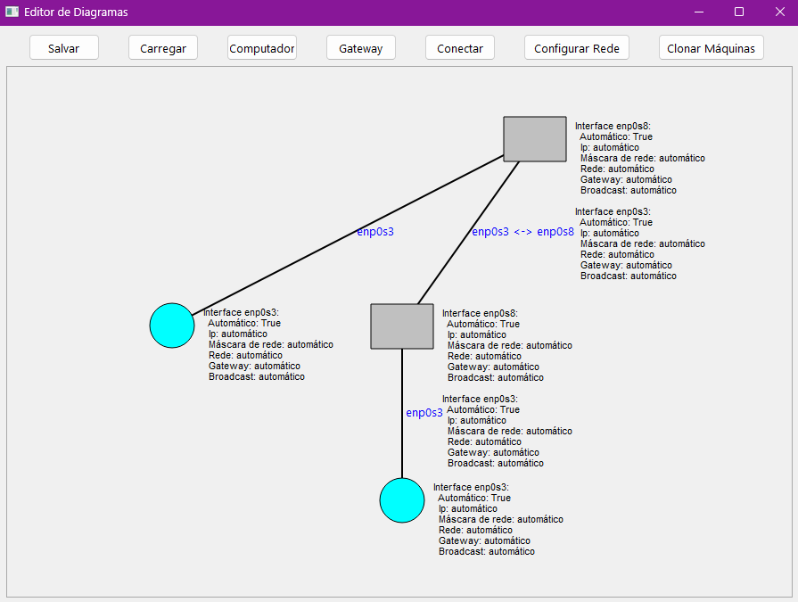

# AutoNetGraph

AutoNetGraph is a desktop application developed in Python that automates virtual machine cloning and network configuration through a graphical interface integrated with VirtualBox.

The project was created as a Computer Science graduation thesis focused on simplifying the creation of virtual network topologies for educational, testing and laboratory environments.

---

## Features 🚀

- Graphical network topology editor
- Automated virtual machine cloning
- Automatic network address configuration
- VirtualBox integration using SDK/API
- Gateway and node management
- Interface-based network connections
- Linux virtual machine provisioning workflow

---

## Technologies 🛠️

- Python
- PyQt6
- VirtualBox SDK

## Concepts

- Virtualization
- Network topology
- Infrastructure automation
- Linux networking

## Motivation

Managing and configuring multiple virtual machines manually for networking and infrastructure laboratories can be repetitive and error-prone.

AutoNetGraph was created to simplify this process through infrastructure automation and a visual topology editor.

---

## Screenshots 📸

### Main Interface


### Network Topology Example


## Demo

The following example demonstrates the creation of a virtual network topology and automatic machine configuration.


---

## How It Works

1. The user selects a base virtual machine from VirtualBox
2. Nodes and gateways can be created through the graphical interface
3. Connections between nodes are defined visually
4. The application clones the virtual machines automatically
5. Network interfaces and IP addresses are configured
6. Machines are initialized and configured sequentially

## Setup ⚙️

### Requirements

- Python 3.11+
- VirtualBox 6.1.14 (https://download.virtualbox.org/virtualbox/6.1.14/)
- VirtualBox SDK 6.1.14
- Linux virtual machine configured in bridge mode

### Clone Repository

```bash
git clone https://github.com/Soniinho/AutoNetGraph
cd AutoNetGraph
```

### Create Environment

#### Linux
```bash
./generate-environment.sh
```

#### Windows
```bash
generate-environment.bat
```

#### Run Application

```bash
python main.py
```
