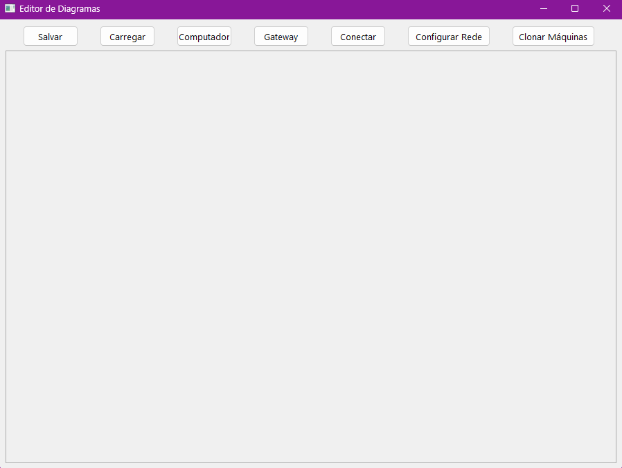

# AutoNetGraph


Projeto desenvolvido como Trabalho de Conclusão de Curso (TCC) com o objetivo de automatizar a criação e configuração de ambientes virtuais de rede utilizando o VirtualBox.

O AutoNetGraph permite construir topologias de rede através de uma interface gráfica, clonar máquinas virtuais automaticamente e configurar seus endereços de rede sem necessidade de configuração manual em cada máquina.

---

## Funcionalidades

- Criação visual de topologias de rede.
- Nós do tipo Computador e Gateway.
- Conexão gráfica entre dispositivos.
- Clonagem automática de máquinas virtuais.
- Configuração automática de endereços IP.
- Automatização de laboratórios virtuais.

---

## Tecnologias Utilizadas

- Python 3.11.1
- VirtualBox 6.1.14
- VirtualBox SDK
- PyQt6
- PyVbox / virtualbox

---

## Requisitos

### Python

O projeto foi desenvolvido utilizando Python 3.11.1:

https://www.python.org/downloads/release/python-3111/

### VirtualBox

É necessário utilizar a versão 6.1.14 do VirtualBox, última versão compatível com a biblioteca utilizada pelo projeto:

https://download.virtualbox.org/virtualbox/6.1.14/

### Máquina Virtual Base

Para utilizar o sistema é necessário possuir uma máquina virtual Linux configurada no VirtualBox com:

- Duas interfaces de rede em modo Bridge.
- Acesso ao usuário root.

---

## Instalação

### Windows

```cmd
generate-environment.bat
```

### Linux

```bash
chmod +x generate-environment.sh
./generate-environment.sh
```

Os scripts criam automaticamente o ambiente virtual e instalam todas as dependências necessárias para execução do projeto.

---

## Como Utilizar

Execute a aplicação:

```bash
python main.py
```

Fluxo básico:

1. Selecione uma máquina virtual base.
2. Crie computadores e gateways na interface gráfica.
3. Conecte os dispositivos desejados.
4. Configure a topologia da rede.
5. Clique em **Clone Machines**.
6. O sistema irá clonar e configurar automaticamente todas as máquinas da topologia.

---

## Exemplo de Topologia

O diretório `examples/` contém exemplos de topologias que podem ser carregadas diretamente pela aplicação.

---

## Limitações

- Requer VirtualBox 6.1.14 devido à compatibilidade da biblioteca PyVbox.
- Atualmente suporta máquinas Linux previamente configuradas.
- A configuração automática depende de acesso root à máquina virtual base.
- O processo de configuração foi desenvolvido e testado utilizando interfaces de rede em modo Bridge.

---

## Capturas de Tela

### Interface Principal



### Exemplo de Topologia


---

## Status do Projeto

✅ Projeto concluído.

Desenvolvido como Trabalho de Conclusão de Curso e disponibilizado para fins de estudo, demonstração e consulta.

---

## Licença

Este projeto está licenciado sob a Licença MIT.

Consulte o arquivo `LICENSE` para mais informações.

---

## Autor

Matheus Henrique Daltroso